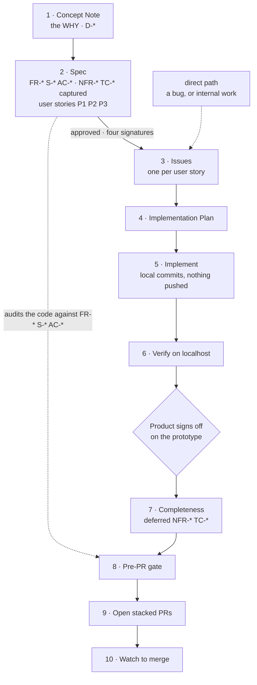

# 6 · The delivery loop

Documents 1 to 4 cover what the documents are. This is how a feature actually moves from idea to
merged code, and it is the part most teams improvise.

It comes from the platform team's practice, which is further along than ours: they run it today.

## Two principles decide everything else

**WHAT before HOW.** A feature's value is decided in the Concept Note and the Spec, not in the
code. That is where the investment goes.

**Prototype first, then completeness.** Get a version that *works* and show it to Product. Only
after they confirm the direction do you give the feature completeness: security, performance, the
rest of the scope.

The second principle is the one that changes the shape of the work, and it is the biggest thing
missing from our own guide.

## The two phases

| | Phase 1 · Prototype | Phase 2 · Completeness |
|---|---|---|
| **Goal** | A working prototype Product can react to | Production-grade, complete feature |
| **Focus** | Functional behaviour: the `FR-*` and scenarios | Security, performance, completeness |
| **`NFR-*` / `TC-*`** | **Captured** in the Spec, **scheduled** | **Implemented** and verified |
| **Trigger** | Ready when localhost proves the happy path | Starts only after Product sign-off |

The subtlety is worth stating twice: **the non-functional requirements are written into the Spec
in Phase 1, they are just not built yet.** They are not discovered later and they are not
optional. Deferring the work is not the same as deferring the decision, and conflating the two is
how "we'll add security later" happens.

The bar for Phase 1 is that the happy path works in a browser. Nothing more.

## Defining the WHAT is a team sport

Product owns the WHY and the scope. Everyone else shapes it, and each role lands in a different
part of the Spec:

| Role | Shapes | Lands as |
|---|---|---|
| **Product** | The WHY and the scope | `D-*`, scope — **and co-authors `FR-*`** |
| **UX** | The experience | `FR-*`, and owns the scenarios, variants and accessibility |
| **Engineering** | Feasibility and how it gets built | `TC-*`, the Plan |
| **Security** | Threats, data, posture | `NFR-*`, `TC-*` |
| **Test / QA** | What automated tests will prove | `S-*` variants, `AC-*` |

**The `FR-*` row is a correction.** The table as first adopted gave functional requirements to UX
alone. But a functional requirement is *the scope translated into behaviour a test can check* —
which makes Product an author there too, not a reviewer. UX stays the owner of the scenarios, the
variants and accessibility.

That distinction is not academic. When `FR-*` belongs to UX alone, Product signs off on
requirements it did not write, and the first place the gap shows is the audit — as a `DIVERGENT`
verdict on behaviour that was never what anyone meant.

Iterate until aligned, not one-shot. The output is a Concept Note and Spec that already carry the
functional, experience, security and test obligations, instead of discovering three of the four in
review.

**This is stronger than an approval gate.** Four signatures at the end catch problems late; four
authors from the start prevent them.

## The ten steps

Every step is a plain-language instruction to a coding agent. You do not type skill names.

| | Step | Who | What happens |
|---|---|---|---|
| 1 | **Concept Note** | Product, iterated with the team | The WHY and the direction. `concept-note.md`, with its `D-*` decisions |
| 2 | **Spec** | Product · UX · Engineering · Security · QA | The WHAT: `FR-*` `S-*` `AC-*`, with `NFR-*` and `TC-*` **captured**. And the split into user stories: `P1` `P2` `P3` |
| ↓ | *approved — four signatures* | | Nothing downstream starts from an unapproved Spec |
| 3 | **Issues** | Product | **One per user story, out of the approved Spec.** `Docs:` the feature folder · `Satisfies:` its own IDs |
| 4 | **Implementation Plan** | Engineering | Real paths, the branch arc, the scenario → test matrix |
| 5 | **Implement** | Coding agent, autonomous | Commits locally, behind a feature flag. Nothing is pushed, so the session can run unattended |
| 6 | **Verify on localhost** | Engineering + Product | The happy path, working in a browser. That is the whole bar for Phase 1 |
| **⏸** | **Product signs off on the prototype** | Product | **Phase 2 does not start before this** |
| 7 | **Completeness** | Engineering + Security | The deferred `NFR-*` and `TC-*` get built, plus the remaining scenario variants |
| 8 | **Pre-PR gate** | Engineering + Security | Four checks — conformance, end-to-end, docs, security — all before anything goes up |
| 9 | **Open stacked PRs** | Engineering | One per branch in the arc, each linked to the issue. Only the last carries `Closes #NNN` |
| 10 | **Watch to merge** | Background agent loop | Merge bottom-up, keeping every branch current. It pings you when the stack is green |

Steps 1 to 6 are Phase 1. Steps 7 to 10 are Phase 2.

### Two changes worth naming

**The issues come out of the approved Spec, not before it.** They used to be step 1, which put a
ticket on the board describing work nobody had specified yet — and then the board waited for a
document that did not exist. Deriving them from the Spec removes that state entirely: an issue
exists because a user story exists, and the user story exists because the Spec says so.

**The split into `P1` `P2` `P3` lives in the Spec.** That is where the argument about what is
independently shippable belongs, with the requirements in front of everyone, rather than in a
refinement meeting three weeks later with only the ticket titles to go on.

### The prompts that drive it

Worth copying nearly verbatim, because the constraints in them are load-bearing:

**Step 2, Concept Note.** *"Draft a concept note for {feature}. Research the codebase first, and
ask me whatever you can't ground."* The second clause is what stops invention.

**Step 3, Spec.** *"Turn this concept note into a spec. Keep the focus on the WHAT, and enumerate
the variants for every scenario."* Variants are where happy-path-only Specs get caught.

**Step 4, Plan.** *"Generate an implementation plan from the spec. Use real file paths, stacked
branches per the arc behind a flag, and a scenario → test matrix."*

**Step 5, Implement.** *"Implement the whole plan end to end. Commit locally as you go, but do NOT
push and do NOT open the PR: stop when it's ready to verify on localhost."* Nothing is pushed, so
the session can run unattended.

**Step 6, Verify.** *"Make sure every service I need to validate {feature} on localhost is
running: start whatever is down. Then walk me through validating the change, and give me example
API calls where that is the clearest check."*

**Step 7, Completeness.** *"Product confirmed the prototype. Now complete {feature}: implement the
deferred NFRs and TCs, and close the remaining scenario variants."*

## Where security actually runs

Three points, and the first is the one that matters:

- **Step 3, writing the Spec.** `secure-dev` is what turns "it should be secure" into
  named `NFR-*` and `TC-*`. Security shapes the WHAT; it is not a review afterwards
- **Step 7, completeness.** Implementing the controls the Spec already committed to
- **Step 8, the gate.** `production-readiness-gate` over the complete feature

Only running the third makes security a veto at the most expensive moment.

## The pre-PR gate: four checks

All four before anything goes up:

1. **Coherence against the Spec.** Run the conformance audit and reconcile any drift.
2. **End-to-end coverage.** Enough browser specs asserting on the real DOM.
3. **Related docs impacted.** Sibling Specs, ADRs and `docs/**` updated in the same change.
4. **Security review.** `production-readiness-gate` over the complete feature, not the prototype.

## What this changes for us

Our guide covered the documents and stopped. This adds the four things it was missing:

- **The two phases**, so a prototype gets validated before anyone invests in completeness
- **Cross-functional authorship of the WHAT**, which is better than our four-signature approval
  gate because it moves the work upstream
- **The ten steps with their prompts**, so the practice is repeatable by someone who was not in
  the room
- **The pre-PR gate**, which is where the traceability from document 3 finally gets enforced

**We adopted the platform team's layout** rather than the methodology's default: documents are
committed to `specs/NNN-feature/` as `concept-note.md`, `spec.md` and `implementation-plan.md`.
The methodology explicitly says to mirror whatever convention a repo already has, and a shared
shape is what lets one person read across four codebases.

---

Next: [Branching and PRs](07-branching-and-prs.md)
