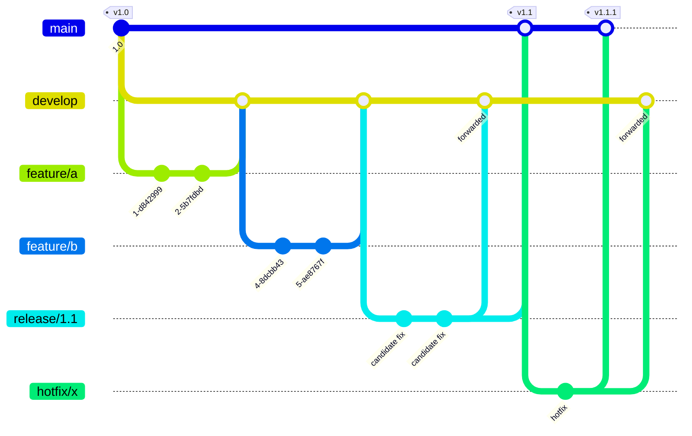

# 7 · Branching and PRs

Four long-lived branches, each bound to an environment and a publish channel. Feature work happens
off `develop` and comes back squashed.

Read the graph for two rules rather than for the shape. **A release branch takes candidate fixes
only** from the moment it is cut. **Every commit on it is forwarded back down to `develop`** — or a
fix made during stabilization is missing from the next version and reappears as a regression. The
hotfix lane exists for the same reason in reverse: branching from `main` rather than `develop` is
what stops it picking up whatever is half-finished.

| Branch | Environment | Channel | Rule |
|---|---|---|---|
| `main` | staging | `release` | Tagged. The last step before production |
| `release/*` | qa | `rc` | Cut from `develop`. **Candidate fixes only** |
| `develop` | dev | `dev` | Deploys on every merge |
| `feature/*` | none | none | Pull-request CI and local. Nothing else |
| `hotfix/*` | none | none | Verified on its PR, then straight to staging |

## How work flows

**Feature branches cut from `develop` and squash back into it.** One commit per feature on
`develop`, so its history reads as a list of features rather than a list of keystrokes. They never
deploy anywhere: their CI is what runs on the pull request, plus whatever you run locally.

**A release branch is cut from `develop` when a version is ready.** From that moment it accepts
**candidate fixes only**: no new features. That is the entire point of cutting it, and the rule
that most often gets bent. Meanwhile `develop` keeps moving, so the next version is never blocked
by the current one stabilizing.

**Every commit on a release branch is forwarded back to `develop`.** Otherwise a fix made during
stabilization is missing from the next version and reappears as a regression.

**When the candidate is ready, the release branch PRs into `main`**, which tags it and deploys to
staging.

**A hotfix branches from `main`, not `develop`.** It is verified on its own pull request and goes
straight to staging, then forwards into `develop` like any other fix. It never picks up whatever
is half-finished on `develop`, which is the reason it exists as a separate lane.

## Channels are not environments

Two different things that are easy to conflate:

- The **channel** is what CI publishes: `dev`, `rc`, `release`
- The **environment** is where it runs: dev, qa, staging

One branch produces one channel that lands in one environment. A build never gets promoted by
being re-tagged into a different channel: it gets rebuilt from the branch that owns that channel.

## Stacked PRs

A feature ships as **several pull requests stacked on each other**, not one large one. How many is
decided by the Implementation Plan's branch arc, which is sized to the feature: one branch for a
refactor, two for backend plus UI, five for a cross-service pair or a data migration.

The rules that make a stack workable:

- **One issue per user story**, and every PR in the stack links to it. That issue is the home for
  the story: progress, blockers, decisions, PR history. A feature with three stories has three
  issues, each with its own stack
- **The last PR carries `Closes #NNN`.** Only the last one, or the issue closes early
- **Each PR is behind a feature flag** so a partially merged stack is never a broken product
- **Merge bottom-up**, keeping each branch current with its parent and with `main`

Merging bottom-up is the tedious part, and it is a good candidate for a background agent loop: it
watches the stack, keeps each branch current, fixes what CI flags, and pings you when everything
is green.

## What a PR has to carry

- **A conventional title** and the repo's PR template
- **A link to the feature issue**
- **A `## Verified by` section naming the tests that prove the change.** Not "tested locally": the
  test names
- **CI green**, including the test-evidence check

## The Spec-Drive gate

The rule that ties this document back to document 3: **a `feat` pull request needs its committed
Spec**, with its `FR-*`, `S-*` and `AC-*`, in the repo. CI checks it.

Advisory first, required later. A genuine exception is declared explicitly with a `no-spec:`
marker rather than by quietly omitting it, which is the same *declared-none-visible* rule the
methodology applies everywhere: an empty answer is legal, a silent one is not.

**Without this gate the rest is voluntary.** Traceability that nothing enforces decays at exactly
the speed of deadline pressure.

## What we have to decide

This model comes from the platform repo. Our client surfaces do not all run it today, and adopting it is
not free:

- **Four long-lived branches need four environments.** A surface without a QA environment cannot run
  `release/*` meaningfully
- **Stacked PRs need review discipline.** Five small PRs reviewed slowly is worse than one large
  PR reviewed fast
- **The Spec-Drive gate needs the Specs to exist first.** Turning it on before that is a gate
  everyone learns to bypass

The sequencing that follows from this: **the gate goes on last**, after the documents exist and
the branch model is running. Turning it on early teaches the team that gates are obstacles rather
than agreements.

---

Next: [The documentation system](08-the-docs-system.md)
