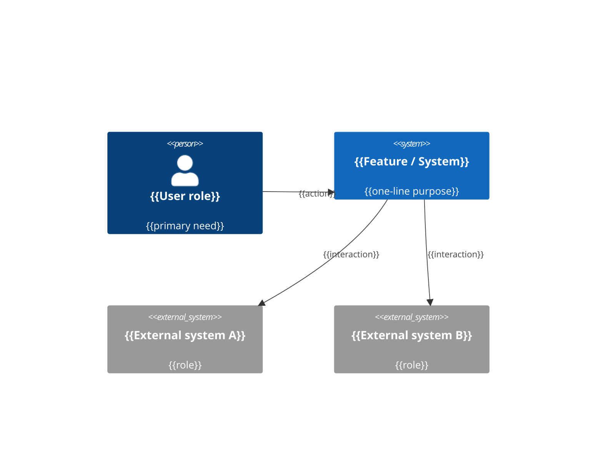

<!--
Concept Note template — stage 1 of 3 in the AI-assisted feature methodology.

This is the *exploration* document. It captures the idea, the research that
informed it, the alternatives considered, and the high-level decisions taken
*before* the team commits to a precise behavioural contract (Spec) or to code
(Implementation Plan).

How to use this template:
- Replace every {{PLACEHOLDER}} with concrete content.
- Delete sections that do not apply to your feature, but never silently — note
  the deletion in §15 "Open questions" so a reviewer can challenge it.
- Keep prose tight. Bullets beat paragraphs in most sections.
- Anchor decisions with stable IDs (D-01, D-02 …) so the Spec and Plan can cite
  them without re-quoting prose.
- Tag unresolved items as `OPEN-Q-N` (e.g. `OPEN-Q-01`, `OPEN-Q-02`, …) so an LLM/human can spot and resolve them. Use two-digit numbering for sortability when N ≥ 10.
- See the companion guidance file
  `staged-engineering-doc/references/concept-note-guidance.md`
  for section-by-section authoring tips.
-->

# {{FEATURE_NAME}} — Concept Note

> **Status:** Draft · **Date:** {{YYYY-MM-DD}} · **Owner:** {{AUTHOR}}
>
> **Reviewers:** {{REVIEWERS}}
>
> **Spec:** *not yet written* · **Implementation plan:** *not yet written*

## 1. TL;DR

{{Three to five sentences a busy reader can quote without opening the rest of
the document. Cover: what is being proposed, who it is for, why now, and the
single most important decision the reader needs to be aware of.}}

## 2. Problem statement

{{What hurts today, who it hurts, and why it is worth solving now.

Prefer concrete examples over abstractions. If you have data (support tickets,
usage funnels, telemetry, NPS), cite it.}}

- **Pain 1** — {{...}}
- **Pain 2** — {{...}}

## 3. Goals

{{What "good" looks like for this feature, expressed as outcomes, not as
features. One bullet per goal; keep it to ~5.}}

- {{Reduce X by Y}}
- {{Enable Z so that …}}

## 4. Non-goals

{{Explicit list of things that *could* reasonably be in scope and are
deliberately *and permanently* not. Each bullet should be defensible — a
reviewer should be able to challenge it. This section directly limits scope
creep entering the Spec.

Distinct from §14 (Out of scope / deferred): non-goals are *we will not
build this*; deferred items are *we will not build this now, but might
later*.}}

- {{We are not building a generic "chat with documents" product.}}
- {{We are not solving cross-session organisational memory.}}

## 5. Vision / desired end state

{{A short narrative — 1 to 3 paragraphs — of what the user-visible end state
feels like. Optionally, write it as a press release (Amazon's PRFAQ pattern)
or as a "day in the life" vignette. The point is to make the value tangible
before the architecture takes over.}}

### 5.1 System context diagram

{{**Required when the feature crosses ≥2 system boundaries** (third-party
services, other internal systems, new infrastructure). Otherwise optional.
Use Mermaid `C4Context` or equivalent `flowchart LR`. ≤15 elements (systems + persons + boundaries for `C4Context`; nodes for `flowchart`); named
actors and systems; no implementation detail. Per MD-24.}}



### 5.2 Security posture (`MD-31`)

Declare, in three short lines (or one paragraph), the security shape of
the feature. This is not a threat model — it is the filter that selects
which CWE categories the Spec's §4.5 *Security constraints* must
address. Silent absence is disallowed; if nothing applies, say so
explicitly with the escape declaration at the bottom of this section.

- **Feature exposure** — {{does this feature process untrusted input?
  From what actor class? e.g. "External HTTP input from public API
  consumers" · "Uploaded files from authenticated internal users" ·
  "No external input — internal batch process reading trusted
  storage"}}
- **Data sensitivity** — {{which regulated / sensitive data classes
  flow through? e.g. "PII, PHI (HIPAA scope), payment card data (PCI
  scope)" · "Session tokens and refresh credentials" · "None
  regulated — public non-PII data only"}}
- **Deployment surface** — {{where does this feature run? e.g. "Public
  REST endpoint behind auth gateway" · "Internal service behind mTLS;
  not reachable from the public internet" · "Embedded library
  consumed by first-party services only"}}

> The three lines above shape the design and select which CWE Top 25
> categories the Spec's §4.5 *Security constraints* must address. Full
> protocol — including the retrieve-live-at-runtime rule for the
> current CWE Top 25, the *"software being built, not the agent"*
> scope, and the *"structural floor, not ceiling"* note on when to add
> more (threat modeling, penetration testing, SAST/DAST, etc. above
> the mandated minimum) — lives in
> `skills/staged-engineering-doc/references/security-protocol.md`
> (kept out of `SKILL.md` per `MD-13`).

*If no security posture applies:*
`Security posture: {{one-line reason, e.g. "internal-only CLI, no external input, no regulated data — no CWE Top 25 categories in scope; §4.5 will declare Security constraints: none — see Concept §5.2 posture"}}`

## 6. Context & background

{{What the reader needs to know before judging the proposal: existing system
landscape, prior attempts, related projects, organisational constraints.

This section is critical for AI agents that lack institutional memory — link
generously to existing docs/tickets/code rather than restating them.}}

- **Existing system** — {{one-paragraph summary + link}}
- **Related work** — {{links}}
- **Organisational context** — {{deadlines, regulatory drivers, partner asks}}

### 6.5 Sources & Origins (`MD-25`)

{{**Section number `6.5` is a deliberate stable ID** (per `MD-05`). §6 has
no §6.1–§6.4 by design — the number leaves headroom for future §6.x
subsections without renumbering §6.5's callers across the codebase.

**Mandatory ledger of the grounding evidence consulted before drafting.**
Three closed sub-lists. Each line is a citation plus a one-line "what this
pinned" note, so a downstream reader can back-derive why an FR/NFR/TC/D-*/TD-*
was shaped the way it was. Empty sub-list must be declared explicitly as
`<sub-list> evidence: none — <one-line reason>` (e.g. `Codebase evidence: none — greenfield feature`); silent absence is not allowed (MD-25 rubric row will flag it).

Spec and Plan add stage-specific citations *inline* where they introduce new
evidence and point back to this section as the master ledger — this doc is
the one place the full grounding ledger lives.}}

**Codebase evidence** — repo-rooted paths read, with a one-line note per citation:

- `{{<repo>/path/to/file.ts:LN}}` — {{what it told you (existing pattern reused / API shape / naming convention / test fixture / migration approach)}}
- `{{<repo>/path/to/module/}}` — {{what it told you}}
- {{…}}

*If nothing applies:* `Codebase evidence: none — {{one-line reason, e.g. "greenfield feature, no existing codebase"}}`

**Industry-standard evidence** — standards checked against the feature, with a one-line note per citation. Three classes to enumerate:

- *Regulatory:* {{HIPAA / GDPR / PCI / SOC 2 / WCAG 2.1 AA / sector-specific — cite section or URL if a specific clause pinned a requirement}}
- *Architectural:* {{12-factor / DDD / microservices / event-driven / CQRS / OAuth·OIDC / REST·gRPC·GraphQL convention / ISO/IEC/IEEE 25010 quality model if the feature has non-trivial quality requirements}}
- *Style / project convention:* {{`AGENTS.md` / `CLAUDE.md` / `CONTRIBUTING.md` / `CODEOWNERS` / `docs/**/*.md` policy files present in the repo; company-specific playbooks}}

*If nothing applies:* `Industry-standard evidence: none — {{one-line reason, e.g. "no regulatory / architectural / style constraints beyond default project conventions"}}`

**Prior-art evidence** — peer products, prior features in this codebase, papers/frameworks:

- {{Peer product / competitor / OSS analog — one-line note on what they do differently}}
- {{Prior Concept Note / Spec / Plan in the same repo — path + one-line note}}
- {{Paper / industry write-up — arXiv ID or DOI + one-line note. Verify arXiv IDs against the actual paper's abstract page per `MD-26` — fabricated citations are a real failure mode.}}

*If nothing applies:* `Prior-art evidence: none — {{one-line reason, e.g. "novel problem shape; no direct peer or literature precedent identified"}}`

## 7. Research & industry context

{{What others do, what the literature says, what we tried in PoCs.}}

### 7.1 How established products handle this

{{Two to five short paragraphs comparing how peers/competitors approach the
problem. Cite specifically — vague "industry trends" claims invite hallucination
both from human and AI readers.}}

- **{{Product A}}** — {{approach + link}}
- **{{Product B}}** — {{approach + link}}

### 7.2 Relevant prior art / papers / standards

- {{Citation + one-line takeaway}}
- {{Citation + one-line takeaway}}

### 7.3 Proofs of concept

{{For each PoC: what was prototyped, the link to the branch/notebook, what was
proven, what was disproven, and whether it should influence the chosen
direction.}}

| PoC | Status | Link | What it proved | What it disproved |
|---|---|---|---|---|
| {{...}} | Done / In progress | {{link}} | {{...}} | {{...}} |

## 8. Proposed direction

{{A high-level sketch — *not* a design. Diagrams welcome, pseudocode
discouraged at this stage. The goal is to give the Spec author enough shape
to commit to functional and non-functional requirements without prescribing
implementation.}}

### 8.1 Approach

{{Narrative — 2 to 5 paragraphs.}}

### 8.2 Information / data model sketch

{{If the feature introduces new domain concepts, describe them at the
*conceptual* level — entities, relationships, lifecycle. Field-level schema
belongs in the Spec or Plan.}}

## 9. Alternatives considered

{{One subsection per alternative. The "why rejected (or deferred)" row is the
most valuable part of this section — without it, future readers will rediscover
the same options.}}

### 9.1 Alternative A — {{name}}

- **Description:** {{...}}
- **Pros:** {{...}}
- **Cons:** {{...}}
- **Decision:** {{Rejected | Deferred | Selected}} — {{why}}

### 9.2 Alternative B — {{name}}

- ...

### 9.3 Comparison summary (optional)

{{For features with 3+ alternatives that materially differ, a side-by-side
table comparing them on cost, risk, complexity, and quality dimensions is
often the single most read part of the Concept Note.}}

| Dimension | Alt A | Alt B | Alt C |
|---|---|---|---|
| {{...}} | {{...}} | {{...}} | {{...}} |

### 9.4 Comparison flowchart (optional)

{{When ≥3 alternatives share a decision tree (e.g. "if X then Alt A; if Y
then Alt B"), a Mermaid `flowchart` visualises the criteria the team
applied. Optional; use only when the decision tree adds value beyond the
table above. ≤15 nodes (flowchart natural unit). Per MD-24.}}

```mermaid
flowchart TD
  start[{{Decision: which alternative?}}]
  start -->|{{criterion 1}}| altA[Alternative A]
  start -->|{{criterion 2}}| altB[Alternative B]
  start -->|{{criterion 3}}| altC[Alternative C]
```

## 10. Key decisions

{{Atomic, ID'd decisions the Spec and Plan will inherit. Each decision should
stand alone — a reviewer should be able to challenge any single decision
without re-reading the entire document.}}

| ID | Decision | Rationale | Reversibility |
|---|---|---|---|
| D-01 | {{Choose X over Y}} | {{Because Z}} | Easy / Hard / One-way |
| D-02 | {{...}} | {{...}} | {{...}} |

## 11. Risks

{{Technical, organisational, security, compliance, cost. One row per risk;
include severity and a current mitigation idea (mitigation detail can be
deferred to the Spec).

Note: *external constraints* (deadlines, regulatory drivers, partner asks,
budget envelopes) belong in §6 Context, not here. *Solution-space mandates*
(must use vendor X, must reuse system Y) belong in §10 Decisions and will
become Spec §4 TC-* later.}}

| Risk | Severity | Likelihood | Mitigation idea |
|---|---|---|---|
| {{...}} | High / Med / Low | High / Med / Low | {{...}} |

## 12. Success signals

{{Not full metrics — those go in the Spec. This is *how will we know we made
the right bet?* Two to five qualitative + quantitative signals.}}

- {{...}}
- {{...}}

## 13. Dependencies & stakeholders

### 13.1 Dependencies

- **Services / vendors:** {{...}}
- **Upstream specs / RFCs:** {{...}}
- **Downstream consumers:** {{...}}

### 13.2 Stakeholders

- **Owning team:** {{...}}
- **Reviewing teams:** {{...}}
- **Customers / partners:** {{...}}

## 14. Out of scope / deferred

{{Explicit parking lot. Each item should answer: *why deferred*, and *what
condition would bring it back into scope*.

Distinct from §4 (Non-goals): non-goals are permanently excluded; deferred
items may return in a later iteration.}}

- {{...}} — *deferred until …*

## 15. Open questions

{{Honest list of what is unresolved at this stage. Each item gets an ID, an
owner, and a target stage at which it must be resolved (Spec / Plan /
Post-launch).}}

| ID | Question | Owner | Target stage | Notes |
|---|---|---|---|---|
| OPEN-Q-01 | {{...}} | {{name}} | Spec | {{...}} |
| OPEN-Q-02 | {{...}} | {{name}} | Plan | {{...}} |

## 16. Handoff to the Spec

{{Short note for whoever (human or AI) will write the Spec from this Concept
Note. Call out what is settled, what must be decided in the Spec, and what
must remain unchanged.}}

- **Settled (do not relitigate):** D-01, D-02, …
- **Decide in Spec:** OPEN-Q-01, OPEN-Q-02
- **Must remain non-goals:** quote each §4 non-goal bullet verbatim (not by section number — sections can be deleted, content cannot drift). E.g. `"The system shall not …"`, `"The system shall not …"`.

## 17. Appendix

{{Links, raw notes, transcripts, benchmark data, AI prompt logs, longer
diagrams. Anything a reader might want but should not be in the body.}}

- {{Link to interview notes}}
- {{Link to spreadsheet of benchmark runs}}

## 18. Change log

| Date | Author | Change |
|---|---|---|
| {{YYYY-MM-DD}} | {{name}} | Initial draft. |

---

*Next document: [Spec](./{{FEATURE_NAME_SLUG}}_SPEC.md). The Spec defines
what the system shall do, how it shall behave, and which solutions are
admissible. Concrete implementation details live in the Implementation Plan,
not here and not in the Spec.*
