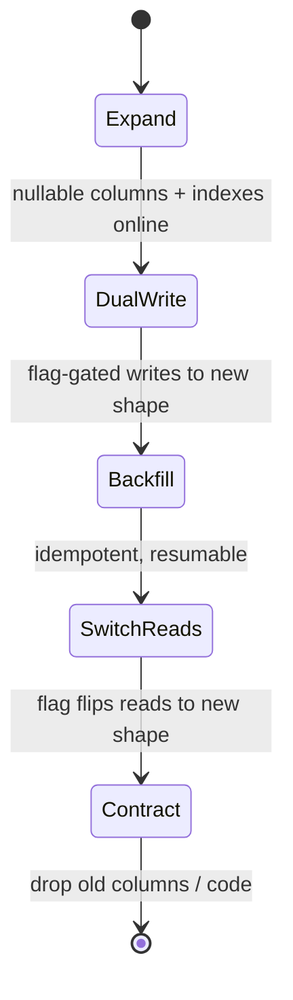
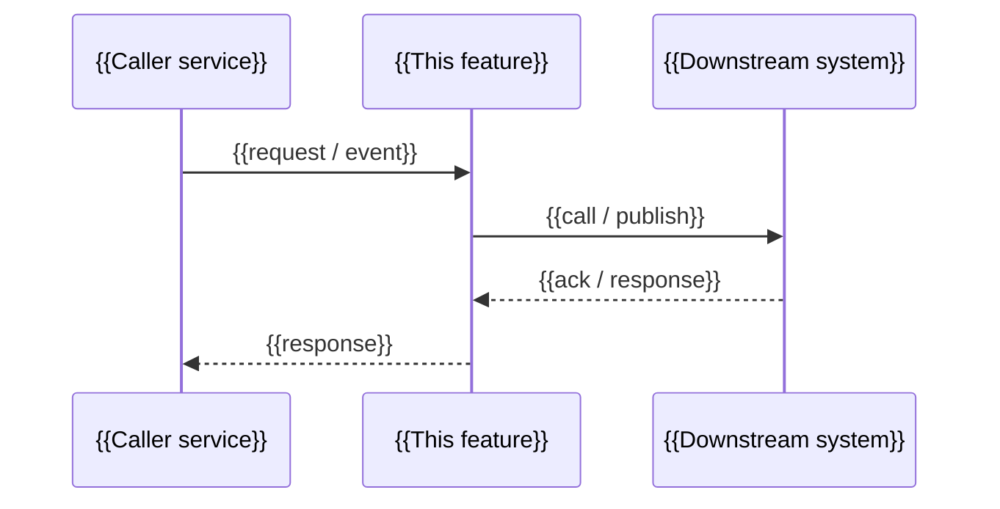

<!--
Implementation Plan template — stage 3 of 3 in the AI-assisted feature
methodology.

This document is the *agent-executable* contract. It tells a human or AI
coding agent exactly what to build, where to put it, and in what order.

How to use this template:
- Replace every {{PLACEHOLDER}} with concrete content.
- Be exact about paths and symbol names. "The auth module" is not a path;
  `src/auth/session.py::SessionService.refresh` is.
- Prescribe inputs/outputs and side effects, not bodies. Pseudocode only when
  control flow is non-obvious. Write tests as the contract.
- Phase work into branches behind a feature flag. Each branch should be
  independently mergeable, testable, and revertible.
- Cite Spec sections (FR-*, NFR-*, TC-*, AC-*, S-*) and Concept Note
  decisions (D-*) on every non-trivial choice. This is what makes the doc
  derivable back to the Spec or Concept Note by an LLM.
- Mark independently parallelisable tasks `[P]` so an agent can fan them out
  to subagents.
- See the companion guidance file `references/implementation-plan-guidance.md`
  for section-by-section authoring tips.
-->

# {{FEATURE_NAME}} — Implementation Plan

> **Status:** Draft · **Date:** {{YYYY-MM-DD}} · **Owner:** {{AUTHOR}}
>
> **Reviewers:** {{REVIEWERS}}
>
> **Spec:** [{{FEATURE_NAME_SLUG}}_SPEC.md](./{{FEATURE_NAME_SLUG}}_SPEC.md)
>
> **Concept note:** [{{FEATURE_NAME_SLUG}}_CONCEPT.md](./{{FEATURE_NAME_SLUG}}_CONCEPT.md)

> **Grounding evidence (`MD-25`).** This Plan grounds in the Concept
> Note's §6.5 *Sources & Origins* ledger and the Spec's inline
> stage-specific citations. Where a T-N task, TD-NN technical decision,
> or module choice is pinned by a specific codebase location beyond what
> §6.5 already captures, cite it *inline* (e.g. `T-2.N1 — Add
> throttling middleware in <repo>/apps/api/src/middleware/rate-limit.ts,
> mirroring the pattern in <repo>/apps/api/src/middleware/auth.ts:LN`) —
> do not defer stage-specific citations to §6.5. If this Plan is being
> authored against a Concept Note whose §6.5 is missing or empty, stop
> and back-derive the missing ledger first; drafting without grounding
> is what MD-25 exists to prevent.

## 1. Summary

{{Three to five sentences. What is being built (technically), the target
release, the core technical objective, and any single non-obvious constraint
the reader must know before reading further.}}

## 2. Goals & non-goals

- **Technical goal 1** — {{...}}
- **Technical goal 2** — {{...}}

**Non-goals:**

- {{We will not refactor module X.}}
- {{We will not change the public API of Y.}}

## 3. Architecture overview

{{**Required** Mermaid block showing how the change fits the existing
system. Per MD-24: use a C4 Component view (`C4Component` or annotated
`flowchart`) for agentic features (multiple specialised agents,
orchestration, tool registry); for non-agentic features a `flowchart`
or `sequenceDiagram` at component level is acceptable. Behaviorally
annotate (key method names on edges, message labels) where it helps.
Container-only views (C4 L2) are deliberately avoided for agentic
features (methodology judgement; arXiv 2603.15021 itself retains L2 —
skip-L2 is our choice, not the paper's). ≤15 elements per diagram (components for C4 Component; nodes for `flowchart`; messages for `sequenceDiagram`); split if larger.
PNG / SVG / ASCII art banned.}}

```mermaid
flowchart LR
  user[{{User / caller}}]
  this[{{This feature — module / service}}]
  ext[{{Adjacent system}}]
  user -->|{{action}}| this
  this -->|{{calls / publishes}}| ext
```

### 3.1 Key design decisions

{{Atomic, ID'd technical decisions made at plan time. These are *new*
decisions on top of the Concept Note's D-*; cite the Concept Note D-* they
descend from.}}

| ID | Decision | Spec ref | Rationale |
|---|---|---|---|
| TD-01 | {{...}} | {{FR-XXX, D-YY}} | {{...}} |
| TD-02 | {{...}} | {{...}} | {{...}} |

## 4. Module map

{{The single most useful section for an agent. Every module/service touched,
its role in this change, and a one-line summary. Do not skip modules just
because they are unchanged — explicitly mark them `untouched` if they sit on
the path of the feature.}}

| Module / package | Role | Status |
|---|---|---|
| `path/to/module_a/` | {{purpose in this feature}} | new |
| `path/to/module_b/` | {{purpose in this feature}} | modified |
| `path/to/module_c/` | {{adjacent; consumed but not changed}} | untouched |
| `path/to/module_d/` | {{being removed}} | deleted |

## 5. Engineering rules / project conventions reference

{{Restate the non-negotiable conventions from the project's AGENTS.md /
CONTRIBUTING / style guide that every branch in this Plan must comply with.
This is here so an AI agent does not have to discover them mid-execution.}}

| Rule | Summary |
|---|---|
| Imports | {{e.g. absolute paths only; PEP 8 ordering; no inline imports}} |
| Typing | {{e.g. type hints required; specific generic conventions}} |
| Logging | {{e.g. use {{library}}; log levels}} |
| Tests | {{naming, location, fixtures convention}} |
| Binding | `variant-a` \| `variant-b` \| `none` — **pick one literal token.** `variant-a` = the ID appears in a framework mark or string argument (`@pytest.mark.scenario("S-04")`, `it("S-04: …")`); `variant-b` = the ID is in the function name (`def test_S_04_…`, `func TestS04_…`); `none` = this branch has **nothing to bind** — no in-scope scenarios and no quantified NFRs (a `refactor-1` arc, say). `T-N.D8`/`D9` stay mechanical and pass vacuously, since `comm -23` over an empty ID set is empty. `none` is **not an opt-out from binding**: Spec `AC-50`/`AC-51` require a structurally-anchored binding for every scenario and every quantified NFR, and Spec §17 lists both as non-relitigable, so a branch that *has* scenarios must declare `variant-a` or `variant-b` and fails `T-N.D8` if it declares `none`. `T-N.D8`/`D9` select their regex from this token, and **the two variants are not interchangeable** — running the `variant-a` regex against function-name bindings silently reports every scenario as uncovered, because identifiers cannot contain hyphens. Free-form prose here is not readable by the gate. **Migrating an existing Plan:** pick the token matching the convention its tests *already* use; `none` is available only to a Plan with no scenarios and no quantified NFRs. |
| Supply-chain | `{{path/to/lockfile}}` \| `none — <reason>` — **pick one token** (`MD-31`). Names the committed lockfile `T-N.D20` scans (`package-lock.json`, `Cargo.lock`, `poetry.lock`, `go.sum`, `Gemfile.lock`, …). `none — <reason>` is legal only when the branch genuinely has **nothing to scan** — a docs-only change, a vendored-deps project with no lockfile, a language with no lockfile concept — in which case `T-N.D20` passes vacuously. Same shape as the `Binding` row: a declared `none` is visible and reviewable; a **silently absent** token (no lockfile named, `none` not declared) is what the Dim 5 rubric grades 🔴, not the vacuous pass itself. |
| Constants | {{file location; magic-number policy}} |
| Commits | {{e.g. Conventional Commits (`type(scope): subject`); cite Spec IDs in subject; one logical change per commit; subject ≤ 72 chars}} |
| Backwards compat | {{required / not required}} |

> The `Commits` row governs the commit-message format used by the
> `T-N.C*` tasks in every branch's §7.x.9 checklist. If AGENTS.md is
> silent on commits, ask the user once for the project's preferred
> style, capture the answer in AGENTS.md (so the next Plan inherits
> it), and restate it here.

## 6. Definition of Done (every branch)

Every branch listed in §7 must satisfy this checklist before merge:

- [ ] Implementation follows the conventions in §5
- [ ] Every Spec section assigned to this branch is implemented (cross-reference Spec refs in subsections)
- [ ] Every Spec scenario (`S-*`) and every enumerated variant (`S-NNa`, `S-NNb`, …) assigned to this branch is covered by a runnable test (gates Spec §11.5 `AC-50`; mechanically verified by `T-N.D8` for variant→test binding and `T-N.D8b` for Variants-block presence)
- [ ] Every quantified NFR assigned to this branch has a measurement test (gates Spec §11.5 `AC-51`; mechanically verified by `T-N.D9`)
- [ ] Every TC (`TC-*`) from Spec §4 has a verification entry in Plan §12 — runnable test (mechanical TCs) or named reviewer / checklist (non-mechanical TCs) (gates Spec §11.5 `AC-52`; mechanically verified by `T-N.D10` for the §12 entry and `T-N.D10b` for the §11.3 compliance check — `AC-52` is a conjunction and needs both)
- [ ] The change's consequences are enumerated in Plan §12.2 *Impact Traceability* — at least one `IMP-*` row per materially-affected scope (`code`/`system`/`business`/`external`), feature-level rather than one row per scenario (gates Spec §11.5 `AC-53`; mechanically verified by `T-N.D15`)
- [ ] Every quantified NFR assigned to this branch has at least one `OBS-*` row in Plan §11 *Observability* (gates Spec §11.5 `AC-54`; mechanically verified by `T-N.D16`)
- [ ] Every branch's committed lockfile passes a current-advisory-DB check with no unwaived advisory (the scanner exits clean); any accepted advisory is cited in §14 as an `R-*` row with a rationale, or the branch declares `Supply-chain: none — <reason>` in §5 (gates Spec §11.5 `AC-55`; mechanically verified by `T-N.D20`) (`MD-31`)
- [ ] Every risk (`R-*`) in Plan §14 in scope for this branch records a mitigation path — a `T-N.*` task in §7.x.9, `accepted (rationale: …)`, or `monitored only — see OBS-NN` (mechanically verified by `T-N.D17`)
- [ ] Self-consistency: every ID referenced inside this Plan resolves to a definition inside this Plan; OPEN-Qs in §15.1 match what is carried forward / resolved (referential integrity, not gap-free numbering; mechanically verified by `T-N.D18`)
- [ ] Cross-consistency: every Spec ID (`FR-*`/`NFR-*`/`TC-*`/`AC-*`/`S-*`) cited by this Plan exists in the Spec, and every Concept Note `D-*` cited by this Plan or by the Spec exists in the Concept Note (mechanically verified by `T-N.D19`)
- [ ] All new tests pass
- [ ] All existing tests pass (no regressions)
- [ ] Linter passes (`{{lint command}}`)
- [ ] Type-checker passes (`{{type-check command}}`)
- [ ] No `TODO`, `FIXME`, or `HACK` comments left in committed code
- [ ] Commit history is clean: each commit is atomic, compiles, and follows §5 *Commits* format (mechanically verified by `T-N.D11`)
- [ ] PR description includes summary of changes, Spec section cross-references, and any decisions made (mechanically verified by `T-N.D12`)
- [ ] {{Project-specific: self-review skill / linters / coverage gate}} (mechanically verified by `T-N.D13`)
- [ ] PR opened against the trunk (mechanically verified by `T-N.D14`)

> **Authoring note (don't delete).** This DoD is normative, but agents
> executing per-branch task lists routinely forget to come back here.
> Two structural moves enforce it:
>
> 1. **DoD as tasks (`T-N.D*`).** The closing tasks of every branch in
>    §7.x.9 enumerate each DoD item above as a discrete, mechanically
>    verifiable task (e.g. `T-N.D3 Run linter — \`{{lint command}}\``,
>    `T-N.D5 Confirm no TODO/FIXME/HACK — \`git grep -nE 'TODO|FIXME|HACK' -- <changed paths>\``,
>    …).
> 2. **Commits as tasks (`T-N.C*`).** Implementation tasks are grouped
>    into atomic, logical commits, with an explicit `T-N.C*` task
>    between groups telling the agent to commit. Without these, agents
>    routinely batch every change into a single closing commit. Format
>    is taken from §5 `Commits` row (sourced from AGENTS.md). Cite
>    Spec IDs in the message.
>
> The §7.2.9 task list at the bottom of Branch 1 below is the
> canonical example for both patterns; mirror it for every other
> branch. Wherever possible, lift the DoD checks into CI / pre-commit /
> PR-template gates so they're enforced at merge time, not just by the
> agent's discipline.

## 7. Branch / phase plan

{{Order branches so each is independently mergeable behind a feature flag.
The number of branches is picked in §7.0 below from a closed arc
vocabulary — the §7.1 tracker and §7.1 branch-graph shapes derive from
that choice. Branch *number* is for ordering; branch *name* is for
purpose. Don't conflate them.}}

{{Replace `{{trunk}}` below with the team's trunk branch name (`main`,
`develop`, or other). Replace `{{prefix}}` with the feature branch
prefix (e.g. `feat/grounding`).}}

### 7.0 Branch sizing (`MD-27`)

{{Pick one arc from the closed vocabulary and declare it inline. Per
MD-27, silent absence (no `Arc:` or `Custom arc:` line) fails the
rubric. See `references/implementation-plan-guidance.md` §7.0 for the
decision-tree, per-arc walk-throughs, and how the §7.1 tracker + graph
adapt to each arc.}}

**Closed arc vocabulary:**

- `refactor-1` — 1 branch — refactor-only (no new behavioural FRs, no user-visible change).
- `single-branch` — 1 branch — small behavioural feature (≤3 FRs, single-service, no migration).
- `two-branch-backend-ui` — 2 branches — backend + user-facing UI both touched.
- `three-branch-scaffold-core-rollout` — 3 branches — mid-complexity, or flag-gated with a progressive-rollout NFR but no cross-service change.
- `five-branch-default` — 5 branches — behavioural feature with a cross-service producer/consumer pair (scaffolding → core-write → core-read → edge-cases → rollout).
- `migration-5` — 5 branches — data migration (expand → dual-write → backfill → switch-reads → contract).

**Decision tree** (top-down, first-match-wins — full detail + Spec
signals in `references/implementation-plan-guidance.md` §7.0):

1. Refactor-only (0 new behavioural FRs) → `refactor-1`
2. Schema change / migration (Spec §10 or Plan §8 populated) → `migration-5`
3. Cross-service producer/consumer pair (Spec §9.2 / Plan §9.2.1) → `five-branch-default`
4. Progressive-rollout NFR (canary / percentage / kill-switch) → `three-branch-scaffold-core-rollout`
5. Backend + user-facing UI both touched → `two-branch-backend-ui`
6. ≤3 FRs, single-service, no migration → `single-branch`
7. Fallthrough → `three-branch-scaffold-core-rollout`

**Arc declaration** (write one line here):

```
Arc: {{arc-name}} — {{one-line justification citing Spec signals}}
```

Example: `Arc: five-branch-default — Cross-service producer/consumer pair (Spec §9.2 new event topic) + progressive-rollout NFR-005`

**Escape valve.** If none of the six named arcs fit, use the explicit
escape declaration instead — the reason must be legitimate (rubric
grades illegitimate reasons 🟡):

```
Custom arc: {{N}} branches — {{one-line reason none of the named arcs fit}}
```

Example: `Custom arc: 3 branches — payments module, wanted scaffold+core+rollout separation for safe enable even though single-service`

> **Branching topology — important.** The default in this methodology is
> that **every branch is based off the team's trunk** (`main` / `develop`),
> *not* off the previous feature branch. The feature flag keeps each
> branch safe to merge in isolation, so there is no need to stack.
>
> Stacked branches (Branch N based on Branch N-1) are an **escalation**,
> reserved for the case where Branch N genuinely cannot compile or be
> tested without uncommitted code from Branch N-1. If you find yourself
> stacking, ask first: can the prior branch be merged behind its flag
> right now? If yes, merge it and re-base off trunk. Stacking should be
> the exception, not the default.
>
> The arrow diagram below describes the **intended merge order**, not the
> git-level base of each branch.

### 7.1 Branch tracker

> Default `Base branch` is the team's trunk. Override only when a branch
> has a hard dependency on uncommitted code from a prior branch — note
> the reason in the `Notes` column when you do.
>
> **Rows below scaffold the `five-branch-default` arc.** Adjust the row
> count to match the arc declared in §7.0 — one row per branch in the
> chosen arc. Per-arc row templates are in
> `references/implementation-plan-guidance.md` §7.0.

| # | Git branch | Base branch | Status | PR | Tests | Notes |
|---|---|---|---|---|---|---|
| 1 | `{{prefix}}/scaffolding` | `{{trunk}}` | Not started | — | — | {{...}} |
| 2 | `{{prefix}}/core-write` | `{{trunk}}` | Not started | — | — | {{...}} |
| 3 | `{{prefix}}/core-read` | `{{trunk}}` | Not started | — | — | {{...}} |
| 4 | `{{prefix}}/edge-cases` | `{{trunk}}` | Not started | — | — | {{...}} |
| 5 | `{{prefix}}/rollout` | `{{trunk}}` | Not started | — | — | {{...}} |

**Branch merge-order graph** (required per MD-24 — Mermaid `flowchart`
showing intended merge order; each branch is based off trunk unless
the tracker's `Base branch` says otherwise):

```mermaid
flowchart LR
  trunk[{{trunk}}]
  B1[Branch 1 — scaffolding]
  B2[Branch 2 — core write]
  B3[Branch 3 — read / UI]
  B4[Branch 4 — edge cases]
  B5[Branch 5 — rollout]
  trunk --> B1 --> B2 --> B3 --> B4 --> B5
  trunk -.->|based off| B2
  trunk -.->|based off| B3
  trunk -.->|based off| B4
  trunk -.->|based off| B5
```

Arrows = intended merge order. Dotted lines = git base. Each branch is
based off trunk, not the previous branch (per MD-12; override only
when the tracker's `Notes` column documents a stacking exception).

---

> **§7.2..§7.x sub-sections below scaffold the `five-branch-default`
> arc.** If §7.0 picked a different arc, keep as many sub-sections as
> that arc has branches, adjust the branch names and goals to match
> that arc's phases, and delete the surplus. Per-arc branch layouts
> are in `references/implementation-plan-guidance.md` §7.0. Per-branch
> sub-structure (§X.1 Design decisions, §X.2 Types, … §X.9 Task
> checklist) stays identical across arcs — only the count and
> per-branch goal change.

### 7.2 Branch 1 — `{{prefix}}/scaffolding`

**Goal:** {{One-paragraph statement of what this branch lands. The end state
should be mergeable Day 1 with zero behaviour change — feature flag off, new
modules empty or stub, migrations applied but unused.}}

**Spec coverage:** FR-{{NNN}}, NFR-{{NNN}}, AC-{{NN}}.

#### 7.2.1 Design decisions specific to this branch

> **{{Decision 1}} (Spec §X)** — {{rationale}}

#### 7.2.2 New types / enums

> Spec ref: §{{...}}

File: `{{path/to/types.py}}`

| Class / enum | Key fields / values | Notes |
|---|---|---|
| `{{TypeName}}` | `{{field}}: {{type}}` | {{purpose}} |
| `{{EnumName}}` | `{{VALUE_A}}`, `{{VALUE_B}}` | {{purpose}} |

#### 7.2.3 New constants

> Spec ref: §{{...}}

File: `{{path/to/constants.py}}`

| Constant | Value | Purpose |
|---|---|---|
| `{{CONST_NAME}}` | `{{value}}` | {{...}} |

#### 7.2.4 Configuration

File: `{{path/to/config.py}}`

| Field | Type | Default | Env var | Notes |
|---|---|---|---|---|
| `enabled` | `bool` | `False` | `{{PREFIX}}_ENABLED` | Feature flag; gates all behaviour. |
| `{{...}}` | `{{...}}` | `{{...}}` | `{{...}}` | {{...}} |

#### 7.2.5 New / modified interfaces

File: `{{path/to/service.py}}`

Class: `{{ServiceName}}` ({{ABC | concrete}})

| Method | Signature | Notes |
|---|---|---|
| `{{method_a}}` | `async ({{args}}) -> {{ReturnType}}` | Spec FR-{{NNN}}. {{semantics}} |
| `{{method_b}}` | `({{args}}) -> {{ReturnType}}` | {{...}} |

#### 7.2.6 Tests

```
{{tests/path/...}}
```

| File | Test class | What it covers |
|---|---|---|
| `{{test_file.py}}` | `{{TestClass}}` | {{behaviour, with FR/NFR/Scenario refs}} |

#### 7.2.7 Verification

- [ ] {{Concrete check 1; verifiable in CI or by manual command}}
- [ ] {{Concrete check 2}}
- [ ] All existing tests pass (no regressions)
- [ ] Feature flag default `False`; no behaviour change to existing flows

#### 7.2.8 Files inventory

**New files:**
```
{{path/...}}
```

**Modified files:**
```
{{path/...}}
```

**Deleted files:**
```
{{path/...}}
```

#### 7.2.9 Task checklist (agent-runnable)

> Flat, ordered, dependency-resolving. Mark `[P]` on tasks that can be
> done in parallel with the previous one (same branch, no shared file).
>
> **Two structural patterns to keep:**
>
> - **Commits as tasks (`T-1.C*`).** Implementation tasks are grouped
>   into atomic commits with explicit commit tasks between groups.
>   Without these, the agent will batch the whole branch into a single
>   commit. Same-purpose tasks → same commit; different layers (impl
>   vs. tests) → different commits. Each commit must compile and pass
>   lint independently (so `git bisect` works). Commit-message format
>   comes from §5 `Commits` row.
> - **DoD as tasks (`T-1.D*`).** The closing tasks enumerate §6 DoD
>   items as discrete verifiable steps. Don't collapse them.
>
> If you fan implementation tasks to subagents (`[P]` markers), hand
> each subagent the relevant `T-1.C*` *and* `T-1.D*` tasks too —
> subagents don't see §5 or §6 unless you give them to them.

Implementation tasks (grouped into atomic commits):

- [ ] T-1.1 Create `{{path/to/types.py}}` with `{{TypeName}}`, `{{EnumName}}`
- [ ] T-1.2 Create `{{path/to/constants.py}}`
- [ ] T-1.C1 Commit (format from §5 `Commits`) — *e.g.* `feat({{scope}}): add core types and constants (FR-001)`

- [ ] T-1.3 [P] Create `{{path/to/config.py}}` with `{{Config}}` settings class
- [ ] T-1.4 Create `{{path/to/service.py}}` with `{{ServiceName}}` ABC
- [ ] T-1.C2 Commit (format from §5 `Commits`) — *e.g.* `feat({{scope}}): add config and service ABC (FR-001, NFR-002)`

- [ ] T-1.5 Add unit tests in `{{tests/path/test_types.py}}`
- [ ] T-1.6 [P] Add unit tests in `{{tests/path/test_config.py}}`
- [ ] T-1.C3 Commit (format from §5 `Commits`) — *e.g.* `test({{scope}}): unit tests for types and config (FR-001)`

DoD verification (§6) — every branch repeats this block, adjusted for
its own command set. **Any code change made during DoD verification
(e.g. fixing a lint warning) becomes its own follow-up commit (`T-1.Cn+1`)
with a `fix(...)` or `chore(...)` message — never silently folded into a
prior commit:**

- [ ] T-1.D1 All new tests pass — `{{test command — e.g. pytest tests/unit/...}}`
- [ ] T-1.D2 All existing tests pass (no regressions) — `{{full-suite command}}`
- [ ] T-1.D3 Linter passes — `{{lint command — e.g. ruff check .}}`
- [ ] T-1.D4 Type checker passes — `{{type-check command — e.g. pyright}}`
- [ ] T-1.D5 No `TODO`/`FIXME`/`HACK` left in changed files — `git grep -nE "TODO|FIXME|HACK" -- <changed paths>` returns nothing
- [ ] T-1.D6 Implementation matches §5 conventions (re-read §5 before submitting)
- [ ] T-1.D7 Every Spec ref assigned to this branch is implemented (cross-check each `FR-*` / `NFR-*` / `TC-*` / `AC-*` against the code)
- [ ] T-1.D8 Every Spec scenario (`S-NN`) *and every enumerated variant* (`S-NNa`, `S-NNb`, …) for this branch has a runnable test. **The regex MUST match the §5 *Binding* token.** If §5 chose string/mark/annotation bindings (`@pytest.mark.scenario("S-04a")`, `it("S-04a: …")`, `t.Run("S-04a", …)`, `#[test_case("S-04a"; …)]`) — use Variant A: `TS_RE='(scenario\("|nfr\("|tc\("|it\(["'"'"']|t\.Run\("|test_case\(")S-[0-9]+[a-z]*'`. If §5 chose function-name bindings (`def test_S_04a_…`, `func TestS04a_…`, `fn s_04a_…`) — use §12.1 Variant B's normalising pipeline (function identifiers cannot contain hyphens, so Variant A will silently report every scenario as uncovered against function-name bindings). **Spec-side enumeration must left-anchor to avoid false-matching `US-NN` user-story IDs**: `comm -23 <(grep -oE '(^|[^A-Za-z])S-[0-9]+[a-z]*' {{path/to/SPEC.md}} | sed -E 's/^[^S]+//' | sort -u) <(<<the §12.1 pipeline matching §5>>)` returns empty for in-scope scenarios and variants. `none` is legal only when the branch has no in-scope scenarios or variants — the left side of the `comm` is then empty and this gate passes vacuously, still mechanically. It is **not** an opt-out: `AC-50` requires a structurally-anchored binding and Spec §17 makes it non-relitigable, so a branch that has scenarios and declares `none` fails this gate. Gate for Spec §11.5 `AC-50`.
- [ ] T-1.D8b Every Spec §9 scenario heading is followed by *either* a `Variants:` block enumerating its shifts OR an explicit `Variants: none — single-path scenario` declaration. This catches the "author forgot to think about variants" failure mode that `T-1.D8` cannot see (`comm -23` only diffs IDs that exist; a missing block is invisible to it). Structural lint with code-fence awareness, multi-level heading support, and robust matching: ``awk 'BEGIN{in_fence=0} /^```/{in_fence=!in_fence; next} in_fence{next} /^#{2,5} +Scenario +S-[0-9]+([^a-z0-9]|$)/ {if(current!="" && !found) print "MISSING Variants block: " current; current=$0; found=0; next} /^[ \t]*\*\*Variants:\*\*/ || /^[ \t]*Variants: *none/ {found=1} END{if(current!="" && !found) print "MISSING Variants block: " current}' {{path/to/SPEC.md}}`` returns empty. Gate for Spec §11.5 `AC-50` (structural half — block presence). The variant ID → test binding half is `T-1.D8` above.
- [ ] T-1.D9 Every quantified NFR (`NFR-*`) for this branch has a measurement test. Same rule as `T-1.D8` (including the §5 *Binding* token selecting the variant, and `none` being legal only when the branch has no quantified NFRs, in which case this gate passes vacuously) but with `NFR-[0-9]+` (no `[a-z]*` suffix — NFRs don't have variants; no left-anchor needed — no NFR-NN substring risk). Variant A: `TN_RE='(nfr\("|it\(["'"'"']|t\.Run\("|test_case\(")NFR-[0-9]+'`. Variant B (function-name, case-insensitive for Rust lowercase identifiers): `TN_RE_FN='(test_|Test|fn )[Nn][Ff][Rr][-_]?[0-9]+'; grep -rEho "$TN_RE_FN" tests/ | sed -E 's/.*[Nn][Ff][Rr][-_]?([0-9]+).*/NFR-\1/' | sort -u`. `comm -23 <(grep -oE "NFR-[0-9]+" {{path/to/SPEC.md}} | sort -u) <(<<Variant A or B per §5, both piped to sort -u>>)` returns empty for in-scope NFRs. Gate for Spec §11.5 `AC-51`.
- [ ] T-1.D10 Every TC (`TC-*`) from Spec §4 is referenced in Plan §12 — either as a runnable verification with the TC ID embedded (mechanical TCs) or as a named reviewer / review checklist (non-mechanical TCs). Verified mechanically: `comm -23 <(grep -oE "TC-[0-9]+" {{path/to/SPEC.md}} | sort -u) <(sed -n '/^## 12\./,/^## 13\./p' {{path/to/PLAN.md}} | grep -oE "TC-[0-9]+" | sort -u)` returns empty. Gate for Spec §11.5 `AC-52`. (Note: this check accepts both forms of evidence — runnable tests *and* reviewer/checklist citations — because TCs are heterogeneous; reviewer review remains a valid form of verification for non-mechanical TCs.)
- [ ] T-1.D10b Every TC (`TC-*`) from Spec §4 also has a **§11.3 compliance check** in the Spec. `AC-52` is a conjunction — a §12 entry alone does not satisfy it — and `T-1.D10` above checks only the §12 half, so a Spec with an empty §11.3 passes the gate while half the criterion goes unexamined. Verified mechanically: `comm -23 <(grep -oE '(^|[^A-Za-z])TC-[0-9]+[a-z]*' {{path/to/SPEC.md}} | sed -E 's/^[^A-Za-z]//' | sort -u) <(sed -nE '/^#{2,4} +11\.3/,/^#{2,4} +11\.4/p' {{path/to/SPEC.md}} | grep -oE '(^|[^A-Za-z])TC-[0-9]+[a-z]*' | sed -E 's/^[^A-Za-z]//' | sort -u)` returns empty. The section range is matched heading-level-agnostically (`##` through `####`) so a future renumbering that promotes or demotes §11.3 does not empty the range — an empty range makes every `TC-*` land on the left of the `comm` and the gate fails loudly against a Spec that is in fact compliant. Use `sed -nE`, not GNU-only `\+`/`\{n,m\}` in a BRE, so the recipe runs on BSD `sed` as well. Gate for Spec §11.5 `AC-52`, second conjunct.
- [ ] T-1.D11 Commit history is clean: each commit is atomic, compiles, and follows §5 `Commits` format (`git log --oneline {{trunk}}..HEAD`)
- [ ] T-1.D12 PR description drafted: summary, Spec cross-refs, decisions made
- [ ] T-1.D13 {{Project-specific gate (self-review skill / coverage / accessibility audit / …)}}
- [ ] T-1.D14 Open PR
- [ ] T-1.D15 The change's consequences are enumerated in §12.2 *Impact Traceability* at **feature granularity** — at least one `IMP-*` row per materially-affected scope (`code`/`system`/`business`/`external`), not one row per scenario. Mechanical floor: `sed -n '/^### 12\.2/,/^### 12\.3/p' {{path/to/PLAN.md}} | grep -cE "^\| *IMP-[0-9]+"` is ≥ 1 (the matrix is non-empty). The reviewer confirms every scope the change materially touches has a row. Gate for Spec §11.5 `AC-53`.
- [ ] T-1.D16 Every quantified NFR (`NFR-*`) for this branch has at least one `OBS-*` row in §11 *Observability*. Verified mechanically: `comm -23 <(grep -oE "NFR-[0-9]+" {{path/to/SPEC.md}} | sort -u) <(sed -n '/^## 11\./,/^## 12\./p' {{path/to/PLAN.md}} | grep -oE "NFR-[0-9]+" | sort -u)` returns empty for in-scope NFRs. Gate for Spec §11.5 `AC-54`.
- [ ] T-1.D17 Every risk `R-*` in §14 in scope for this branch records a mitigation path. Verified mechanically: every `R-*` row has a non-empty *Mitigation task* cell (a `T-N.*` task, `accepted (rationale: …)`, or `monitored only — see OBS-NN`), and every `T-N.*` *cited* in §14 resolves to a task *defined* in some §7.x.9 checklist — `comm -23 <(sed -n '/^## 14\./,/^## 15\./p' {{path/to/PLAN.md}} | grep -oE "T-[0-9]+\.[A-Z]?[0-9]+" | sort -u) <(grep -oE "^- \[[ x]\] T-[0-9]+\.[A-Z]?[0-9]+" {{path/to/PLAN.md}} | grep -oE "T-[0-9]+\.[A-Z]?[0-9]+" | sort -u)` returns empty. (The right-hand side is restricted to checkbox-*defined* task IDs in §7.x.9, not every mention in the file — otherwise §14's own references would match themselves and the gate would never fire.)
- [ ] T-1.D18 **Self-consistency pass** — within this Plan: every ID referenced from one section resolves to a definition in another section of the same Plan (no dangling intra-doc references); every `OPEN-Q-*` listed in §15.1 is either marked resolved with a pointer to where it was answered, or is also surfaced in the PR description. Recipe in `references/review-passes.md` (Pass 1). Referential integrity only — non-contiguous numbering is fine by design, do not gate on gaps.
- [ ] T-1.D19 **Cross-consistency pass** — across documents: every Spec ID (`FR-*`/`NFR-*`/`TC-*`/`AC-*`/`S-*`) cited anywhere in this Plan exists in the Spec; every Concept Note `D-*` cited in this Plan or in the Spec exists in the Concept Note; every Spec OPEN-Q targeting "Plan" is resolved here or carried into §15.1. Recipe per family (Pass 2 in `references/review-passes.md`): `comm -23 <(grep -oE '(^|[^A-Za-z])<PREFIX>-[0-9]+[a-z]*' {{path/to/PLAN.md}} | sed -E 's/^[^A-Za-z]//' | sort -u) <(grep -oE '(^|[^A-Za-z])<PREFIX>-[0-9]+[a-z]*' {{path/to/SPEC.md}} | sed -E 's/^[^A-Za-z]//' | sort -u)` returns empty (substitute `FR`, `NFR`, `TC`, `AC`, `S`); same with `D-` against the Concept Note. **The left-anchor and the `sed` are both required.** **A bare `grep -oE "<PREFIX>-[0-9]+"` fabricates dangling references** — it matches inside a longer prefix, so `D-` hits `TD-`/`MD-`, `S-` hits `US-`/`OBS-`, and `FR-` hits `NFR-`. A Plan citing `MD-12` would be reported as citing a Concept decision that was never written. Any output is a *dangling reference* — fix the typo or add the missing definition before merging.
- [ ] T-1.D20 **Supply-chain audit** — the branch's committed lockfile has no unwaived advisory. Default recipe: `osv-scanner --lockfile={{path/to/lockfile}}` **exits non-zero when it finds any advisory**, so the gate passes on a clean exit and fails otherwise. There is no severity threshold on the scan path (`osv-scanner` #1400 was closed *not planned*) and deliberately none in this gate — **severity judgement lives in the waiver, not the command**. Language-native equivalents share the same exit-code-on-any-finding shape: `npm audit` (non-zero on any vuln by default), `pip-audit`, `cargo audit`, `govulncheck ./...`, `bundle audit`. Use each tool's **default text output** and check its exit status — do *not* pass `--format=json`/`sarif` (`govulncheck` exits `0` under structured formats, a false pass). Any advisory the team accepts must appear in §14 as an `R-*` row with a rationale (severity, exploit path, compensating control) and (where possible) an `OBS-*` residual-risk signal; the rubric grades the rationale. If §5 declares `Supply-chain: none — <reason>` (no lockfile to scan), this gate passes vacuously. Gate for Spec §11.5 `AC-55` (`MD-31`). **The scanner retrieves current advisory data at run time** — a check that passed yesterday can fail today when a new advisory lands, and that is the desired behaviour. In offline / air-gapped environments where the scanner cannot retrieve, leave this checkbox unchecked **AND add a `[UNVERIFIED — offline; advisory DB unreachable]` marker to §15.1 *Open questions*** — a silently-unchecked box grades 🔴 (skipped gate); a disclosed offline box grades 🟡 (diligence-blocked, per `MD-26`).

---

> **Per-branch sub-structure.** For each branch below, apply the
> sub-sections shown in §7.2 (`.1` Design decisions, `.2` New types,
> `.3` Constants, `.4` Config, `.5` Interfaces, `.6` Tests, `.7`
> Verification, `.8` Files inventory, `.9` Task checklist).
>
> **Skip subsections that don't apply to this branch.** A rollout
> branch usually has no new types or constants; an edge-cases branch
> may have no new config. Don't carry empty placeholder subsections
> through — they add noise. Always keep `.7` Verification, `.8` Files
> inventory, and `.9` Task checklist; the rest are conditional.
>
> **Always include the closing DoD block (`T-N.D1`–`T-N.D20`) and the
> commit-grouping pattern (`T-N.C*` between implementation-task
> clusters) in every branch's `.9` task checklist.** These are the two
> obligations agents most commonly skip because they're implicit
> elsewhere in the Plan. Repeating them as concrete tasks per branch
> is what makes them gated rather than advisory.

### 7.3 Branch 2 — `{{prefix}}/core-write`

**Goal:** {{Smallest end-to-end vertical slice of the write path, behind the
feature flag. Dark-launchable.}}

**Spec coverage:** FR-{{NNN}}, NFR-{{NNN}}, AC-{{NN}}, scenarios S-{{NN}}.

{{Apply relevant sub-sections from §7.2. Group implementation tasks
into atomic commits with `T-2.C*` tasks between them; close with a DoD
block `T-2.D1`–`T-2.D20`. Mirror §7.2.9 with this branch's commands and
commit messages.}}

---

### 7.4 Branch 3 — `{{prefix}}/core-read`

**Goal:** {{Read path / UI; consumes Branch 2 outputs.}}

**Spec coverage:** {{...}}

{{Apply relevant sub-sections from §7.2. Group implementation tasks
with `T-3.C*` commits and close with `T-3.D*` DoD block.}}

---

### 7.5 Branch 4 — `{{prefix}}/edge-cases`

**Goal:** {{Error paths, retries, rate limits, observability.}}

**Spec coverage:** {{...}}

{{Apply relevant sub-sections from §7.2. Group implementation tasks
with `T-4.C*` commits and close with `T-4.D*` DoD block.}}

---

### 7.6 Branch 5 — `{{prefix}}/rollout`

**Goal:** {{Progressive flag enable, dead-code removal, flag retirement
ticket filed.}}

**Spec coverage:** {{...}}

{{Apply relevant sub-sections from §7.2 — for a rollout branch this is
typically just `.7` Verification, `.8` Files inventory, and `.9` Task
checklist. Even a rollout branch with only flag-flip and dead-code
removal needs at least one `T-5.C*` (per logical change) and the closing
`T-5.D*` DoD block.}}

## 8. Data model & migrations

### 8.1 Schema changes

| Table / collection | Change | Index changes | Default values | Backfill plan |
|---|---|---|---|---|
| `{{table_a}}` | add column `{{col_x}}` `{{type}}` `NULL` | new index `{{name}}` | {{...}} | {{...}} |

### 8.2 Migration strategy

{{Describe the expand-migrate-contract sequence if applicable. Each phase
maps to a branch in §7 — fill in the branch number once you know the
arc you're using.}}

| Phase | Description | Lands in branch |
|---|---|---|
| Expand | Add nullable columns; create indexes online; no behaviour change. | Branch {{N}} |
| Dual-write | Write to both old and new shape behind the flag. | Branch {{N}} |
| Backfill | Idempotent, resumable one-time job (or batched). | Branch {{N}} |
| Switch reads | Toggle reads to the new shape behind the flag. | Branch {{N}} |
| Contract | Drop old columns / code after verification window. | Branch {{N}} (typically the rollout branch) |

**Migration state diagram** (required per MD-24 when migrations are
present — each state maps to a branch in the table above):



### 8.3 Reversibility

{{For each phase, specify whether it is reversible and how. If forward-only,
state the data-loss blast radius and the recovery procedure.}}

## 9. API & contract changes

### 9.1 New / modified endpoints

| Method + path | Auth | Request | Response | Status codes | Spec ref |
|---|---|---|---|---|---|
| `{{POST /api/v1/...}}` | {{...}} | {{shape}} | {{shape}} | `200`, `4xx`, `5xx` | FR-{{NNN}} |

### 9.2 Internal contracts

{{Function signatures, queue/event payloads, and shared types crossed by
this feature.}}

#### 9.2.1 Cross-service sequence diagram

{{**Required** per MD-24 when the feature introduces ≥1 new
producer/consumer pair (queue events, RPC calls across service
boundaries). Optional for single-service features. Mermaid
`sequenceDiagram`; ≤15 actors/messages; one diagram per flow (split if
larger).}}



### 9.3 Backwards compatibility

{{Per-API: what is preserved, what is deprecated, what is removed. State
the deprecation window (typically two releases).}}

## 10. Configuration & feature flags

| Flag | Type | Default per env (dev / beta / prod) | Owner | Kill-switch behaviour |
|---|---|---|---|---|
| `{{flag_name}}` | bool | `false` / `false` / `false` | {{owner}} | {{...}} |

## 11. Observability

> Each row is an `OBS-NN` — the post-deploy signal that proves a Spec
> behaviour or NFR is actually working in production. Every quantified
> `NFR-*` in Spec §8 must have at least one `OBS-*` row whose *Binds to*
> column embeds the NFR ID (gates Spec §11.5 `AC-54`; mechanically
> verified by `T-N.D16`). Scenarios (`S-*`) and risks (`R-*` from §14)
> may also bind to observability signals — list each in the same
> *Binds to* column when applicable. Keep the `OBS-*` numbering
> sequential for readability.

| ID | Signal | Type | Source | Binds to | Threshold / use |
|---|---|---|---|---|---|
| OBS-01 | `{{metric_name}}` | counter / gauge / histogram | `{{module}}` | NFR-{{NNN}} | `{{≥ X req/s; alert when ...}}` |
| OBS-02 | `{{trace_span}}` | span | `{{handler}}` | S-{{NN}} | `{{p95 latency target; page when ...}}` |
| OBS-03 | `{{log_key}}` | structured log | `{{module}}` | FR-{{NNN}} / R-{{NN}} | `{{audit / debugging / detection signal for R-NN}}` |
| OBS-04 | `{{alert_name}}` | alert | `{{Alertmanager/PagerDuty}}` | NFR-{{NNN}} | `{{condition + routing}}` |

**Dashboards:** {{links + the panels each dashboard exposes}}.

## 12. Test plan

{{Roll-up across branches.}}

### 12.1 Scenario Traceability Matrix

> **The gate that catches functional gaps.** Every scenario `S-NN` in
> Spec §9 — *and every enumerated variant* `S-NNa`, `S-NNb`, … from
> the Variants sub-blocks — must appear in this matrix with a
> runnable test. A blank `Test` cell is the same kind of bug as a
> blank cell in §16 below — caught by Spec §11.5 `AC-50`. Pick the
> test level using the decision-tree in `references/implementation-plan-guidance.md`
> §12; happy-path unit tests alone are not sufficient. Variants of
> one scenario may legitimately ship at different levels (a
> `[boundary]` variant as a unit test while the parent scenario —
> the happy walk — ships as e2e).
>
> **Level vocabulary.** The `Level` column accepts: `unit`,
> `integration`, `contract`, `e2e`, `property`. A row may list more
> than one (`unit + property`, `integration + contract`) when a
> scenario warrants belt-and-braces coverage. No fixed pyramid ratio
> is prescribed — the shape of the suite falls out of per-scenario
> decisions, not a declared target.
>
> This is a Requirements Traceability Matrix (RTM) restricted to
> behavioural scenarios. Industry-standard term (IEEE/ISO/IEC/IEEE
> 29148); already used in recent multi-agent AI papers (e.g. arXiv
> 2510.19868) that load RTMs into agent context.
>
> **Test-binding convention.** Every test that satisfies a Spec ID
> embeds that ID in canonical hyphenated form (`S-04`, `NFR-001`,
> `TC-010`) via a framework-native string or annotation. Prefer
> string-based bindings (marks, subtest names, `it()` strings,
> attributes) over function names because most languages don't allow
> hyphens in identifiers — and the hyphenated form is what the
> mechanical `grep` gates look for.
>
> | Stack | Recommended (preserves `S-NN` form) |
> |---|---|
> | pytest | `@pytest.mark.scenario("S-04")` · `@pytest.mark.nfr("NFR-001")` · `@pytest.mark.tc("TC-010")` |
> | Vitest / Jest / Mocha | `it("S-04: upload succeeds", …)` — same shape for `NFR-NN`, `TC-NN` |
> | Cypress / Playwright | `it("S-04: upload succeeds", { tags: ["@S-04"] }, …)` |
> | Go | `t.Run("S-04", func(t *testing.T) { … })` (subtest name preserves the hyphen) |
> | Rust | `#[test_case("S-04"; "upload_succeeds")]` or `// scenario: S-04` comment on the `#[test]` fn |
>
> Function-name bindings (`def test_S_04_…`, `func TestS04_…`,
> `fn s_04_…`) are **acceptable** but use the language's allowed
> separator (underscore / nothing) rather than the canonical hyphen.
> Projects that prefer function-name bindings must use the *normalising*
> grep variant shown in the auto-derivation block below.
>
> Pick one convention per project and record it in §5 of this Plan
> (the conventions table — `Tests` row). The matrix below can then be
> derived mechanically by `grep`, and `T-N.D8` (scenarios + variants →
> tests), `T-N.D8b` (Variants-block structural presence — the awk lint
> over §9 Scenario headings), `T-N.D9` (NFRs), and `T-N.D10` (TCs)
> become runnable checks rather than manual reviews.
>
> **Multi-scenario tests.** A single test may cover multiple scenarios
> (e.g. a parametrised test `test_upload[S-04]` / `test_upload[S-05]`
> or a combined-flow test `test_S_04_and_S_05_dual_upload`). List each
> `S-NN` it satisfies on its own row in the matrix pointing at the
> same test path — the grep gate handles this correctly.

| Spec scenario | Test | Level | Branch |
|---|---|---|---|
| S-01 (happy parent) | `tests/e2e/test_{{...}}.py::test_S_01_happy_walk` | e2e | Branch 2 |
| S-01a `[boundary]` min | `tests/unit/test_{{...}}.py::test_S_01a_min_size` | unit | Branch 2 |
| S-01b `[boundary]` max | `tests/unit/test_{{...}}.py::test_S_01b_max_size` | unit | Branch 2 |
| S-01c `[failure]` over-max | `tests/integration/test_{{...}}.py::test_S_01c_rejects_over_max` | integration | Branch 4 |
| S-01d `[concurrency]` | `tests/integration/test_{{...}}.py::test_S_01d_concurrent_uploads` | integration | Branch 4 |
| S-01e `[property]` | `tests/property/test_{{...}}.py::test_S_01e_upload_invariants` | unit + property | Branch 4 |
| S-10 | `tests/integration/test_{{...}}.py::test_S_10_…` | integration | Branch 3 |
| S-20 | `tests/unit/test_{{...}}.py::test_S_20_no_state_mutation` | unit | Branch 4 |

> **Auto-deriving the matrix** (optional but recommended). Anchor the
> test-side regex to your §5 *Binding* token so comments
> don't false-match — a loose `grep -rEho "S-[0-9]+" tests/` will count
> any incidental mention (e.g. `# similar to S-04 but different`) as
> coverage.
>
> **Variant A — string/mark bindings (recommended).** The convention
> keeps the canonical hyphenated form; the regex just anchors it to a
> recognised binding context. The `[a-z]*` suffix catches Spec §9
> variant IDs (`S-04a`, `S-04b`, …) alongside parent scenario IDs:
>
> ```bash
> # All scenario / variant IDs declared in the Spec
> # (left-anchored so user-story IDs like US-04 don't false-match):
> grep -oE '(^|[^A-Za-z])S-[0-9]+[a-z]*' {{path/to/SPEC.md}} | sed -E 's/^[^S]+//' | sort -u
>
> # All scenario / variant IDs actually bound to tests
> # (the binding-anchor prefix already prevents US- false-matches):
> TS_RE='(scenario\("|nfr\("|tc\("|it\(["'"'"']|t\.Run\("|test_case\(")S-[0-9]+[a-z]*'
> grep -rEho "$TS_RE" tests/ | grep -oE "S-[0-9]+[a-z]*" | sort -u
>
> # The diff is the gap (empty = no gap):
> comm -23 <(grep -oE '(^|[^A-Za-z])S-[0-9]+[a-z]*' {{path/to/SPEC.md}} | sed -E 's/^[^S]+//' | sort -u) \
>          <(grep -rEho "$TS_RE" tests/ | grep -oE "S-[0-9]+[a-z]*" | sort -u)
> ```
>
> **Variant B — function-name bindings.** Use only when the project's
> §5 convention chooses function names over marks/strings. The grep
> matches the language's allowed separator (including the variant
> suffix letter) and a `sed` normalises to the canonical hyphenated
> form:
>
> ```bash
> # pytest (test_S_04a_…) / Go (TestS04a_…) / Rust (s_04a_…):
> TS_RE='(test_|Test|fn s_)S?[-_]?[0-9]+[a-z]*'
> grep -rEho "$TS_RE" tests/ \
>   | grep -oE '[Ss][-_]?[0-9]+[a-z]*' \
>   | sed -E 's/[Ss][-_]?([0-9]+[a-z]*)/S-\1/' \
>   | sort -u
> ```
>
> **For `NFR-NN`** (gates `AC-51` via `T-N.D9`) and `TC-NN` (gates
> `AC-52` via `T-N.D10`) the inlined Variant B regexes are documented
> in §7.2.9 T-1.D9 / T-1.D10 respectively. Do **not** mechanically
> substitute `NFR-` or `TC-` into Variant B above — its sed pipeline
> hardcodes case-insensitive `[Ss]` plus `[a-z]*` (variant suffix)
> which don't apply to NFRs/TCs. NFRs and TCs have no variants, and
> their case conventions differ project-to-project, so each prefix
> gets its own literal pipeline.

### 12.2 Impact Traceability

> **The gate that catches consequence gaps.** Each row is an `IMP-NN`
> — one consequence of this change. Impact is recorded at **feature
> granularity**: the change must have at least one `IMP-*` row for
> every materially-affected scope, *not* one row per scenario. A
> single row may be *triggered by* several `S-*` / `FR-*` — list them
> all in the *Triggered by* column (gates Spec §11.5 `AC-53`;
> mechanically verified by `T-N.D15`).
>
> Coding agents reliably implement behaviour but under-reason about
> consequences ("what did I just break?"). The matrix forces explicit
> enumeration: where does the impact land (`scope`), which Spec ID
> triggered it, which risk is associated (`R-*`), which observability
> signal will detect it (`OBS-*`), which task mitigates it (`T-N.*`).
>
> **Scope vocabulary** (closed — pick exactly one per row):
>
> | Scope | When to use |
> |---|---|
> | `code` | Files, interfaces, internal contracts inside this codebase change. |
> | `system` | Other services / queues / data stores in the same deployment touch this change. |
> | `business` | A user-visible capability or business metric is affected. |
> | `external` | Consumers outside the team (mobile app, partner API, customer docs) are affected. |
>
> Keep `IMP-*` numbering sequential for readability.

| ID | Scope | Description | Triggered by | Risk | OBS | Mitigation task |
|---|---|---|---|---|---|---|
| IMP-01 | code | {{affected files / interfaces}} | S-{{NN}}, FR-{{NNN}} | R-{{NN}} or — | OBS-{{NN}} or — | `T-{{N.N}}` |
| IMP-02 | system | {{affected services / queues}} | S-{{NN}} | R-{{NN}} | OBS-{{NN}} | `T-{{N.N}}` |
| IMP-03 | business | {{affected capability / metric}} | FR-{{NNN}} | — | OBS-{{NN}} | `T-{{N.N}}` |
| IMP-04 | external | {{affected consumers / docs / partners}} | FR-{{NNN}} | R-{{NN}} | — | `T-{{N.N}}` |

> **The mechanical floor.** Because impact is feature-level, the gate
> is a non-emptiness check, not a per-scenario `comm`:
>
> ```bash
> # §12.2 must contain at least one IMP-* row:
> sed -n '/^### 12\.2/,/^### 12\.3/p' {{path/to/PLAN.md}} | grep -cE "^\| *IMP-[0-9]+"
> ```
>
> The reviewer then confirms every scope the change materially touches
> has a row — that judgement (which scopes apply) is not mechanisable,
> so the gate enforces the floor and the review enforces coverage.

### 12.3 Unit tests

- {{Test file paths and what they cover; reference the per-branch test tables. Unit tests on top of the scenario coverage above — *additional* coverage beyond the enumerated scenarios.}}

### 12.4 Integration tests

- {{...}}

### 12.5 Contract tests

- {{Producer/consumer pairs; tooling.}}

### 12.6 End-to-end / smoke tests

- {{Pre-rollout smoke; post-deploy verification.}}

### 12.7 Manual QA (if any)

- {{...}}

### 12.8 Performance / load tests

- {{To verify quantified NFR-{{NNN}}. Spec §11.5 `AC-51` requires every quantified NFR to land in this section with a measurement test.}}

## 13. Rollout plan

{{Operational sequence for enabling the feature in production. References
§7 branches and §10 flags by name.}}

1. Merge Branch 1 (scaffolding).
2. Merge Branches 2–4 sequentially as each passes its DoD.
3. Enable flag in dev → run smoke → monitor for {{period}}.
4. Enable flag in beta → run smoke + manual scenarios → monitor for {{period}}.
5. Progressive prod enable: {{e.g. 5% → 25% → 50% → 100% over N days}}.
6. Merge Branch 5 (rollout & cleanup); file flag-retirement ticket.

## 14. Risks & rollback

> Each row is an `R-NN`. Every `R-*` must record a **mitigation path**
> in the *Mitigation task* cell — one of: a `T-N.*` task in the
> per-branch §7.x.9 checklists, `accepted (rationale: …)`, or
> `monitored only — see OBS-NN`. So an accepted or watch-only risk has
> a valid entry rather than being forced to invent a task (gated by
> `T-N.D17`). When the *Detection signal* is an observability signal,
> cite the `OBS-*` ID directly so a reviewer can confirm it exists in
> §11. Keep `R-*` numbering sequential for readability.

| ID | Risk | Likelihood | Severity | Detection signal | Mitigation task | Rollback procedure |
|---|---|---|---|---|---|---|
| R-01 | {{description}} | low / med / high | low / med / high | `OBS-{{NN}}` / {{manual check}} | `T-{{N.N}}` | {{flip flag / revert PR / re-run migration}} |
| R-02 | {{...}} | {{...}} | {{...}} | `OBS-{{NN}}` | monitored only — see OBS-{{NN}} | {{...}} |

**Worst-case blast radius:** {{...}}.

## 15. Open questions & assumptions

### 15.1 Open questions

| ID | Question | Owner | Resolution by branch | Notes |
|---|---|---|---|---|
| OPEN-Q-01 | {{from Spec OPEN-Q-X}} | {{name}} | {{Branch N}} | {{...}} |
| OPEN-Q-02 | {{...}} | {{name}} | {{Branch N}} | {{...}} |

### 15.2 Assumptions

| ID | Assumption | Owner | If false |
|---|---|---|---|
| A-01 | {{e.g. {{vendor}} indexing latency < 60 s}} | {{name}} | {{revisit §X; possibly invalidates Branch N}} |
| A-02 | {{...}} | {{name}} | {{...}} |

## 16. Acceptance criteria coverage

{{Map every Spec `AC-*` to the branch that satisfies it AND to the test
that verifies it. A blank cell in either column is a gap.

The `Test` column is what makes coverage *mechanically verifiable* — an
agent or reviewer can run the referenced test and observe pass/fail
rather than relying on prose claims that the AC is satisfied. Combined
with the §12.1 *Scenario Traceability Matrix* and the tag-based binding
convention there, this section is largely derivable from `grep` over
the test suite.}}

| Spec AC | Satisfied by | Test |
|---|---|---|
| AC-01 | Branch 2 | `tests/e2e/test_{{...}}.py` suite — covers `S-01`..`S-09` (each test tagged with its `S-NN`; see §12.1) |
| AC-02 | Branch 3 | `tests/integration/test_{{...}}.py::test_S_10_…` (single-scenario AC) |
| AC-10 | Branch 4 | `tests/perf/test_p95.py` |
| AC-50 | Branch 4 | (meta-gate — verified by §12.1 every `S-*` row populated; `T-N.D8` `comm -23` returns empty AND `T-N.D8b` awk lint over Spec §9 returns empty) |
| AC-51 | Branch 4 | (meta-gate — verified by §12.8 every quantified NFR has a measurement test) |
| AC-52 | Branch 2 | (meta-gate — verified by §11.3 + §12 every TC has a compliance check) |
| AC-53 | Branch 4 | (meta-gate — verified by §12.2 having an `IMP-*` row per materially-affected scope, feature-level) |
| AC-54 | Branch 4 | (meta-gate — verified by §11 every quantified NFR has at least one `OBS-*` row binding to it) |
| AC-55 | Branch 4 | (meta-gate — verified by `T-N.D20` scanning the §5 `Supply-chain` lockfile clean, or the `Supply-chain: none — <reason>` token; any accepted advisory carried as an `R-*` row in §14) |

> The `Test` column references either a single test (when the AC covers
> one scenario) or a test *suite* (when the AC aggregates multiple
> scenarios, like `AC-01` above). The actual binding from each `S-NN` to
> its test is in §12.1 — that's the matrix `T-N.D8` greps. Tests carry
> the scenario / NFR / TC ID in their name or tag (per §5 *Engineering
> rules*); they do **not** carry the AC ID, since ACs aggregate.

## 17. Change log

| Date | Author | Change |
|---|---|---|
| {{YYYY-MM-DD}} | {{name}} | Initial draft. |

---

*This Implementation Plan is the contract a coding agent (human or AI)
executes. Behavioural questions belong in
[{{FEATURE_NAME_SLUG}}_SPEC.md](./{{FEATURE_NAME_SLUG}}_SPEC.md). Motivation
and decision rationale belong in
[{{FEATURE_NAME_SLUG}}_CONCEPT.md](./{{FEATURE_NAME_SLUG}}_CONCEPT.md).*
